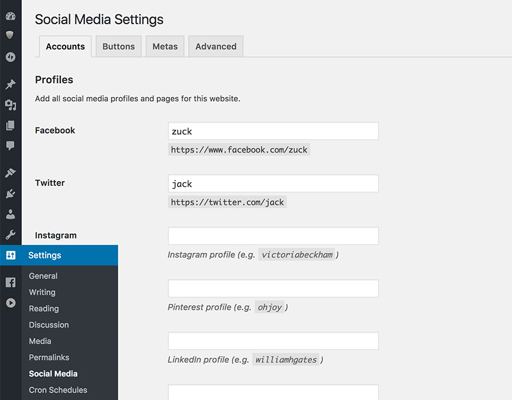
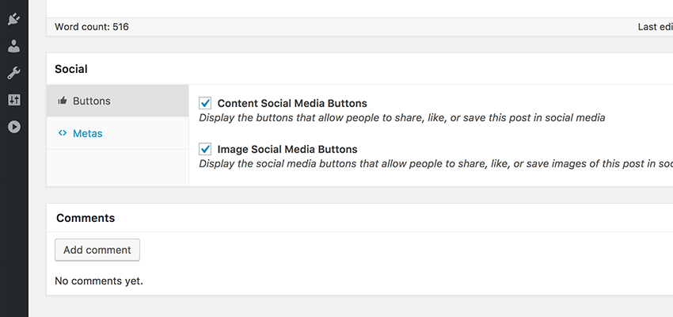
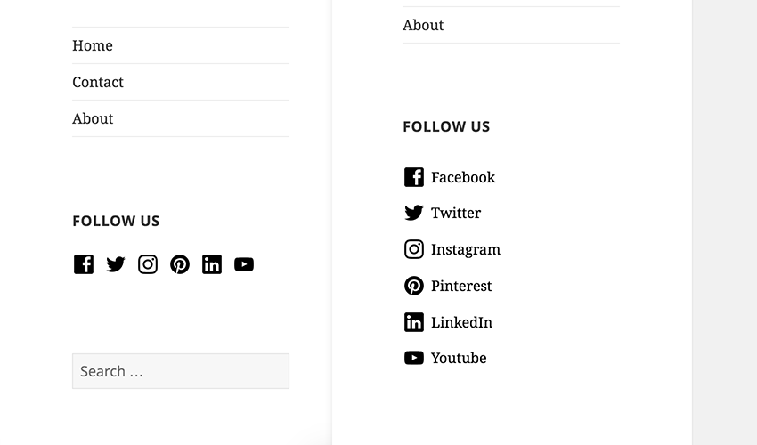

<!-- DO NOT EDIT THIS FILE; it is auto-generated from readme.txt -->
# Social Media Manager


Lightweight, clean and optimized social media plugin for WordPress.

**Contributors:** [ninecodes](https://profiles.wordpress.org/ninecodes), [tfirdaus](https://profiles.wordpress.org/tfirdaus), [hongkiat](https://profiles.wordpress.org/hongkiat)  
**Tags:** [widget](https://wordpress.org/plugins/tags/widget), [json](https://wordpress.org/plugins/tags/json), [wp-api](https://wordpress.org/plugins/tags/wp-api), [social-media](https://wordpress.org/plugins/tags/social-media), [sharing](https://wordpress.org/plugins/tags/sharing), [facebook](https://wordpress.org/plugins/tags/facebook), [twitter](https://wordpress.org/plugins/tags/twitter), [pinterest](https://wordpress.org/plugins/tags/pinterest), [open-graph](https://wordpress.org/plugins/tags/open-graph), [twitter-cards](https://wordpress.org/plugins/tags/twitter-cards)  
**Requires at least:** 4.7  
**Tested up to:** 4.7.3  
**Stable tag:** 2.0.0-alpha.3  
**License:** [GPLv2 or later](http://www.gnu.org/licenses/gpl-2.0.html)  

[](https://travis-ci.org/ninecodes/social-manager) [](https://coveralls.io/github/ninecodes/social-manager) [](http://gruntjs.com) 

## Description ##

This plugin helps you optimize your website for social media with [Open Graph](http://ogp.me/) and [Twitter Cards](https://dev.twitter.com/cards/overview) meta tags. Facebook, Twitter, and other social media sites will evaluate these meta tags to understand your content better and enable to preview the content on the [News Feed](https://www.facebook.com/help/327131014036297/) nicely. This plugin allows you to customize the meta tags, so you have more control over your posts and pages presentation.

Other features included in the plugin:
### Social Media Buttons ###
Display social buttons to allow your readers sharing your website posts and pages to Facebook, Twitter, Pinterest, LinkedIn, Reddit, etc. You can also display the social buttons on the images within the content.

With the increasing trend on using WordPress as a [*headless* CMS](https://2016.sydney.wordcamp.org/session/using-wordpress-as-a-headless-cms/), this plugin also exposes a couple of custom **JSON API** routes using the [WP-API](http://v2.wp-api.org/) infrastructure in WordPress. The API allows developers to retrieve the social media sharing endpoint URLs of a particular post or page and render the sharing buttons in, for example, a JavaScript-based theme.

### Social Media Profiles ###
With this plugin you can add your social profile and page URLs and display them on a widget. No need to mess around with your theme Menu ever again; the widget will stay there even when you've changed the theme.

### Translations ###
- English
- Indonesian

Translate this plugin to your language on [__translate.wordpress.org__](https://translate.wordpress.org/projects/wp-plugins/ninecodes-social-manager).

### Requirements ###
- PHP 5.3 or higher
- WordPress 4.5 or higher


## Installation ##

### WordPress Plugins Directory (Recommended): ###
1. Visit _Plugins > Add New_
2. Search for **Social Media Manager**
3. On the search result, click the "Install Now" button of **Social Media Manager** by NineCodes
3. Activate **Social Media Manager** from the Plugins page.

### Manual Upload: ###
1. Download the plugin `.zip` archive.
2. Visit _Plugins > Add New_
3. Click **Upload Plugin**
4. Click **Choose File**, and select the plugin `.zip` package you have just downloaded.
6. Click **Install Now**.
3. Activate **Social Media Manager** from the Plugins page.

### FTP Upload: ###
If none of the above ways work, though it will be less convenient, you can try installing the plugin via FTP (File Transfer Protocol). To do this, you will need an FTP software installed on your computer, such as:

* [FileZilla](https://filezilla-project.org/) (Windows, macOS, Linux)
* [CyberDuck](https://cyberduck.io/) (Windows, macOS)
* [CarotDAV](http://rei.to/carotdav_en.html) (Windows)

Then, login to your server *with the credentials given by your hosting provider*.

1. Download the plugin `.zip` archive.
2. Unzip the archive and upload the `ninecodes-social-manager` folder into the plugin folder (`/wp-content/plugins/`).
3. Activate **Social Media Manager** from the _Plugins_ page.

### Once Activated: ###
1. This plugin adds a new setting page named **Social** under the **Settings** menu in the WordPress admin screen. You can customize the output made by the plugin through this page.
2. This plugin also adds some extra fields in the user profile edit screen (`/wp-admin/profile.php`).
3. This plugin registers a custom route at `/ninecodes/v1/social-manager/buttons`.


## Theme Support ##

If you are a Theme developer, you can add `add_theme_support( 'ninecodes-social-manager' )` in the `functions.php` of your theme themes to customize the plugin at Theme level. The following are the "features" that this plugin currently supports.

**Remove the plugin stylesheet**

Set the `stylesheet` to `true` will dequeue the plugin stylesheet. This allows you to customize the the plugin output through your theme stylesheet to match your theme design as a whole without having to do an override.

```php
add_theme_support( 'ninecodes-social-manager', array(
	'stylesheet' => true, // Means the theme supports (loads) the stylesheet.
) );
```

**Custom attribute prefix**

The plugin add prefix `social-manager` to (almost) any HTML elements it generates at the front-end (your theme). You can change this prefix to anything you want by adding the `attr_prefix`, for example:

```php
add_theme_support( 'ninecodes-social-manager', array(
	'attr_prefix' => 'social',
) );
```

Keep in mind that changing the prefix to other than `social-manager` will dequeue the stylesheet much like setting the `stylesheet` to `true`. So you will have to add the styles at your end.

**Changing the Buttons Mode**

The plugin offers 2 modes, `HTML` and `JSON`, to generate, what called as the **Social Buttons**; the buttons that allow your site users to share content on social media. By default the mode is set to `HTML`, which will *echo* all the HTML markup in the post content. But, if you are building a [*headless* WordPress theme](https://pantheon.io/decoupled-cms) using whatever JavaScript renders (Backbone, Angular, React, Vue, Ember, you name it), you might want to switch the plugin to the `JSON` mode.

```php
add_theme_support( 'ninecodes-social-manager', array(
	'buttons_mode' => 'json',
) );
```

## Frequently Asked Questions ##

None, at the moment. Please ask. :)

## Screenshots ##

### The plugin settings page.



### The plugin custom meta box to enable or disable social buttons on the content and images.



### Social media profile widget settings.


### Social media profile widget view on the front-end.



### Social buttons to share the content.


### Social buttons to share the content image.


## Changelog ##

### [1.1.2] - 2017-02-05 ###
* __Added__: `sanitize_icon` function to sanitize icon output.
* __Changed__: The plugin screenshot showing the Profiles screen in the Social Media Setting page.
* __Changed__: Translator comments in a number translate-able strings with more than one type identifiers.
* __Fixed__: Namespace for backward compatibility.

### [1.1.1] - 2017-02-03 ###
* __Fixed__: The template tags, `the_author_social_profiles` and `the_site_social_profiles`, output sanitization.

### [1.1.0] - 2017-01-25 ###
* __Added__: `get_the_site_social_profiles` and `the_site_social_profiles` template tag to show the social profile on an arbitrary location within the theme.
* __Added__: `get_the_author_social_profiles` and `the_author_social_profiles` template tag to show the social profile of specified author on an arbitrary location within the theme.
* __Added__: New social media meta tags such as `article:section`, `article:tag`, `article:published_date`, and `article:modified_date`.
* __Added__: Aliases for `add_theme_supports` name.
* __Changed__: Improved Filter hooks of the Icons.
* __Changed__: Setting menu label to "Social Media", instead of just "Social".
* __Changed__: Setting screen title to "Social Media Settings", instead of just "Social Settings".
* __Changed__: A few option inputs description and labels for better UX.

### [1.0.6] - 2017-01-10 ###
* __Added__: Add "Settings" link in the plugin Table List.
* __Changed__: Improved `/buttons` API by extending `WP_REST_Controller`.
* __Changed__: The translation file source (`.pot`) to add the new strings in the source code.
* __Changed__: Indonesian translation files (`.mo` and `.po`) following the changes in the `.pot` .
* __Changed__: Element attribute prefix from `ninecodes-social-manager` to `social-manager`.
* __Changed__: The `data-social-buttons` attributes now is `data-social-manager`.
* __Fixed__: Do not load stylesheet when it is disabled in the **Settings** page, even when the widget is active.
* __Fixed__: Do not render the social buttons when the post is not published.
* __Fixed__: Only load the scripts in a single post, page, and custom post type.

Read more at [Version 1.0.6 Release Note](https://github.com/ninecodes/social-manager/releases/tag/v1.0.6)

### [1.0.5] - 2017-01-05 ###
* __Changed__: Update the translation file source (`.pot`).
* __Changed__: Indonesian translation (`.mo` and `.po`).
* __Fixed__: Stylesheet must not be enqueued when disabled even when the Social Profile Widget is active.

### [1.0.4] - 2017-01-03 ###
* __Changed__: render the icons before anything else, which should allow the icons to render ASAP without being blocked by slow JavaScript files.
* __Changed__: remove enclosed slash for Twitter Cards meta tags.
* __Changed__: incorrect file header.
* __Changed__: move the `add_theme_support` usage instruction to "Theme Support" section under "Other Notes" tab.
* __Changed__: the "END:" comment tags for consistency.
* __Changed__: the button endpoint URLs should be under ‘endpoints’ object, and the Underscore.js template following this change.
* __Fixed__: adjust the icon size and padding ensuring the icon is perfectly aligned to the center.

### [1.0.3] - 2017-01-02 ###
* __Added__: [Open Graph Protocol Tools](https://github.com/niallkennedy/open-graph-protocol-tools) library files.
* __Changed__: use Open Graph Protocol Tools methods to generate Open Graph meta tags for validation and standardization.
* __Changed__: use double quotes instead of single quote to wrap up Twitter Cards meta tags value following meta tags generated through [Open Graph Protocol Tools](https://github.com/niallkennedy/open-graph-protocol-tools).
* __Changed__: shorten the plugin name (drop "by NineCodes").

### [1.0.2] - 2017-01-01 ###
* __Changed__: namespacing Backbone application
* __Changed__: set dependency of the `preview-profile.js` to just `backbone`. The `backbone` will also enqueue `jquery` and `underscore`.
* __Changed__: feed to News Feed (Facebook)
* __Changed__: update "Tested up to" to 4.7.
* __Changed__: transform HTML markup in `readme.txt` to its entity (also fixed wp.org render HTML code block issue).
* __Changed__: remove `edit_user_profile_update` duplicate action

### [1.0.1] - 2017-01-01 ###
* __Added__: screenshot images.
* __Fixed__: code block formatting in the `readme.txt`.
* __Fixed__: endpoint address stated in the "Installation" section of `readme.txt`.
* __Fixed__: the use of `$this` keyword in the metabox required files path.
* __Changed__: the JavaScript function to compile Underscore template.
* __Changed__: call Backbone Model `.fetch()` method after the Views are already instantiated.

### 1.0.0 ###
* Initial release.


## Upgrade Notice ##

### 1.1.2 ###
* Sanitize icon output, fixed namespace for backward compatibility, and update screenshot.

### 1.1.1 ###
* Fixed the template tag function output.

### 1.1.0 ###
* Added template tag functions, additional Open Graph meta tags, improvement on the Filter hooks, and numerous bug fixes.

### 1.0.6 ###
* Numerous bug fixes, and improvements in the REST API response as well as in the plugin code structure.

### 1.0.5 ###
* Update translations and fixed bug with the stylesheet enqueue when the "Social Media Profiles" widget is active.

### 1.0.4 ###
* A few minor bug fixes, and changes to retain consistency.

### 1.0.3 ###
* A few minor changes in the generated meta tags.

### 1.0.2 ###
* A few minor bug fixes, tweaks in Backbone application, and fixed `readme.txt` formatting issue.

### 1.0.1 ###
* Added screenshot images, fixed a number of bugs and error formatting in `readme.txt` file, and a few improvements in the JavaScript.

### 1.0.0 ###
* Initial release.


